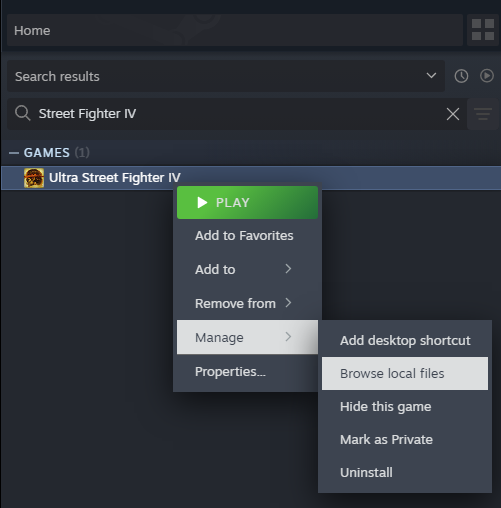

# sf4e

A process-inspection and modification tool for the Steam release of _Ultra Street Fighter 4_.

[TOC]

## Running

### Supported environments
* Windows: Windows 10 or later
* Linux: Fedora 40+, Steam Deck

### Running on Windows

Windows users with a working Steam installation can run sf4e by extracting a release then double-clicking on `Launcher.exe`. sf4e will attempt to detect your SF4 installation automatically. Windows users with uncommon or damaged Steam installations may run `Launcher.exe` with the `STEAM_APP_PATH` environment variable to the absolute path of the `Super Street Fighter IV - Arcade Edition` directory installed by Steam. You can navigate to this directory using the Steam library's context menu by right-clicking on Ultra Street Fighter IV's library entry, hovering over "Manage", then selecting "Browse local files", as shown below.



### Running on Linux

The most straighforward way to launch sf4e on Linux is with [protontricks](https://github.com/Matoking/protontricks). Extract the release, then run `protontricks-launch Launcher.exe` and select SF4 from the popup UI. For convenience, `protontricks-launch --appid 45760 Launcher.exe` can be used to launch sf4e non-interactively, ex. from shell scripts or program shortcuts.

Linux users who do not install `protontricks` may set the `STEAM_APP_PATH` environment variable to the path of the the `Super Street Fighter IV - Arcade Edition` directory installed by Steam, as demonstrated above. Users should take care to ensure the variable points to a Windows-formatted path accessible from within the Proton container for SF4, and it may be helpful to take advantage of Wine providing the Linux system root as the `Z:` root inside Wine to specify the path. For example, if the local directory is available at `/home/steamdeck/.local/share/Steam/steamapps/common/Super Street Fighter IV - Arcade Edition`, the corresponding path through the Proton container would be `Z:\\home\\steamdeck\\.local\\share\\Steam\\steamapps\\common\\Super Street Fighter IV - Arcade Edition`.

## Building

`sf4e` is built primarily with [Visual Studio](https://visualstudio.microsoft.com/)
2019 16.10 or later with Visual C++. Other development environments will need
support for installing dependencies, ideally via [vcpkg](https://vcpkg.io/en/index.html)
and build file generation via [CMake](https://cmake.org/).

To build sf4e with VS2019 16.10+:

1. Follow steps 1 and 2 in [`vcpkg`'s Getting Started guide](https://learn.microsoft.com/en-us/vcpkg/get_started/get-started),
   stopping after `vcpkg` has been bootstrapped.
   - You can stop at step 3- sf4e already has a manfest file.
2. Set up a local `CMakeUserPresets.json` to describe your environment.
   The following can be used as a quickstart, making sure to provide the
   path to the copy of `vcpkg` checked out in step 1: 
```
{
    "version": 2,
    "configurePresets": [
      {
        "name": "default",
        "inherits": "x86-msvc-ninja-relwithdebinfo",
        "environment": {
          "VCPKG_ROOT": "C:/Users/myuser/path/to/vcpkg"
        }
      }
    ]
  }
  
```
   - Since SF4 is a 32-bit executable, `sf4e` and its dependencies
     (most importantly Detours) also need to be built targeting a
     32-bit host to properly hook SF4's instructions.
3. Open `CMakeLists.txt` with VS2019's native CMake integration.
   - Ensure [CMakePresets.json integration in Visual Studio](https://learn.microsoft.com/en-us/cpp/build/cmake-presets-vs?view=msvc-170#enable-cmakepresets-json-integration) is enabled.
4. Run `Build All`. Confirm that `Launcher.exe` and `Sidecar.dll` are in
   the build output.
5. Run `Launcher.exe`.

To build sf4e with the CMake command line:

1. Set up `vcpkg`, as above in step 1.
2. Set up a local `CMakeUserPresets.json` to describe your environment,
   as above in step 2.
3. Using a CLI environment with CMake and a compiler prepared, run
   `cmake --preset default` from the root of the repository.
   - VS users may wish to use either the x86 Native Tools or the
     x64_x86 Cross Tools developer command prompts, as they already
     provide tools like Ninja and Cmake, and have the various environment
     variables used by CMake already prepared.
4. Build sf4e by running `cmake --build ./path-to-binary-dir/` from the root
   of the repository. Confirm that `Launcher.exe` and `Sidecar.dll` are in
   the build output.
   * If a `CMakeUserPresets.json` file like the one in step 2 is used, the
     the binary dir is `./msvc-build/default`.
5. Run `Launcher.exe`.

Builds generated with CMake that cannot take advantage of `vcpkg` will need to
provide the following dependencies:

* [Detours](https://github.com/microsoft/Detours). Detours is used to install
  custom netplay hooks at runtime.
* [ValveFileVDF](https://github.com/TinyTinni/ValveFileVDF). ValveFileVDF
  is used to parse Steam's configuration files, to automatically detect
  your installation of SF4.
* [Dear Imgui](https://github.com/ocornut/imgui). Dear Imgui is used to
  provide custom overlays for new features and non-durable,
  development-time debugging.
* [spdlog](https://github.com/gabime/spdlog). `spdlog` is used to provide
  durable file logging, both at development time and in release builds.
* [nlohmann/json](https://github.com/nlohmann/json). `json` is used for
  message serialization.
* [GameNetworkingSockets](https://github.com/ValveSoftware/GameNetworkingSockets/).
  `GamenNetworkingSockets` provides a very helpful high-level API on top
  of message passing, and additionally supports NAT hole punching if
  a signalling server is run.
* [GGPO](https://github.com/pond3r/ggpo), used to provide rollback.

## License

This project is licensed under the MIT License - see the LICENSE.md file for details.

## External Licenses and Copyright Information

Street Fighter, Street Fighter 4, Ultra Street Fighter 4, and all related software
Copyright © CAPCOM.

Steam
Copyright © Valve Corporation.

Visual Studio, Visual Studio 2019, vcpkg, and Detours
Copyright © Microsoft Corporation.

CMake - Cross Platform Makefile Generator
Copyright © Kitware, Inc. and Contributors.

ValveFileVDF
Copyright © Matthias Möller.

Dear Imgui
Copyright © Omar Cornut

spdlog
Copyright © 2016 Gabi Melman.

nlohmann/json
Copyright © 2013-2022 Niels Lohmann

GameNetworkingSockets
Copyright © 2018, Valve Corporation

GGPO (Good Game Peace Out)
Copyright © GroundStorm Studios, LLC.